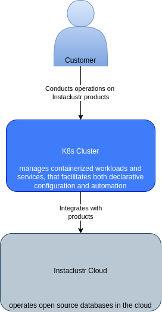
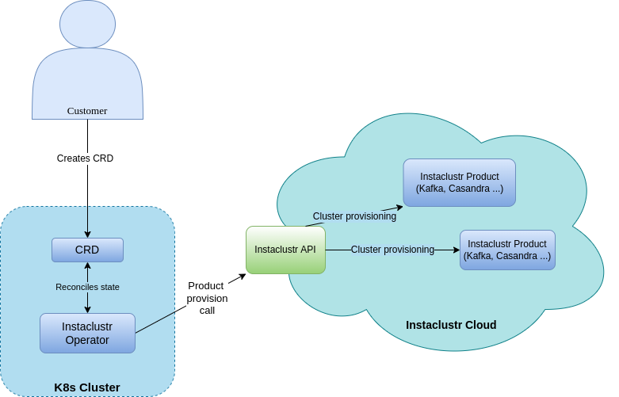
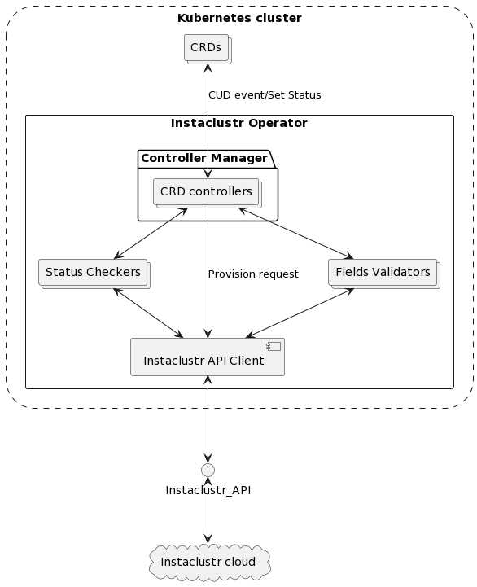
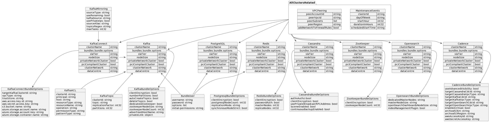

# Instaclustr Operator
The Instaclustr Operator allows users to deploy, scale and manage any one of
data layer technologies deployed on the Instaclustr platform from within Kubernetes.

## Description
The Instaclustr Operator provides all the same functionality as the Instaclustr API,
Instaclustr Console and Instaclustr terraform provider. 
- Removes the need to write custom code integration directly with the Instaclustr API
- Use of existing Instaclustr authentication methodologies
- Declare Instaclustr infrastructure up front
- Scale, modify and change Instaclustr infrastructure with
  existing Kubernetes management tools / workflows
- Simplify Kubernetes native development workflow patterns
  (CI/CD integrations, production deployments etc).

## Getting Started
You’ll need a Kubernetes cluster to run against. You can use [KIND](https://sigs.k8s.io/kind) to get a local cluster for testing, or run against a remote cluster.
**Note:** Your controller will automatically use the current context in your kubeconfig file (i.e. whatever cluster `kubectl cluster-info` shows).

### Running on the cluster
1. Create the .env file inside your home folder (~/.env), copy all content from the .env.tmpl and fill variables. When the operator deploys, it will create the secret from these variables to access the Instaclustr API.
Create the config/manager/kustomization.yaml file and copy all content from the config/manager/kustomization.yaml.tmpl. Also, be sure that you've already installed the pre-commit hook. Use `make install-pre-commit` to accomplish. It will prevent you from pushing secret data to the public repository.

2. Deploy the cert-manager:

```sh
make cert-deploy
```

3. Build and push your image to the location specified by `IMG`:
	
```sh
make docker-build docker-push IMG=<some-registry>/operator:tag
```

4. Deploy the controller to the cluster with the image specified by `IMG`:

```sh
make deploy IMG=<some-registry>/operator:tag
```

5. Install needed instances of Custom Resources:

```sh
kubectl apply -f config/samples/<resource-group>/<resource-name.yaml>
```

**NOTE:** You can also run `IMG=<some-registry>/operator:tag make` to simply install the controller

### Uninstall CRDs
To delete all CRDs from the cluster:

```sh
make uninstall
```

### Undeploy controller
Undeploy the controller from the cluster:

```sh
make undeploy
```

### Undeploy cert-manager
Undeploy the cert manager:

```sh
make cert-undeploy
```

## Contributing

We welcome all contributors. Please see our public [contributing guidelines](CONTRIBUTING.md).


### How it works
This project aims to follow the Kubernetes [Operator pattern](https://kubernetes.io/docs/concepts/extend-kubernetes/operator/)

It uses [Controllers](https://kubernetes.io/docs/concepts/architecture/controller/) 
which provides a reconcile function responsible for synchronizing resources untile the desired state is reached on the cluster 

### Test It Out
1. Run the controller tests:

```sh
make test
```

### Modifying the API definitions
If you are editing the API definitions, generate the manifests such as CRs or CRDs using:

```sh
make manifests
```

**NOTE:** Run `make --help` for more information on all potential `make` targets

More information can be found via the [Kubebuilder Documentation](https://book.kubebuilder.io/introduction.html)

## Support Contact

Please reach out to support@instaclustr.com for issues with this Instaclustr Operator. Please note that we've disabled the issues feature on this repository.

The support status of this project is available through https://www.instaclustr.com/support/documentation/announcements/instaclustr-open-source-project-status/.


## C4 model diagrams

|                             Context diagram                             |  Container diagram                                       |  Component diagram|
|:-----------------------------------------------------------------------:|:--------------------------------------------------------:|:-------------------------:|
|   |   |  |

|                             CRDs Relations                              |
| :---------------------------------------------------------------------: |
|         |


## License

Apache2 - See the included LICENSE file for more details.
