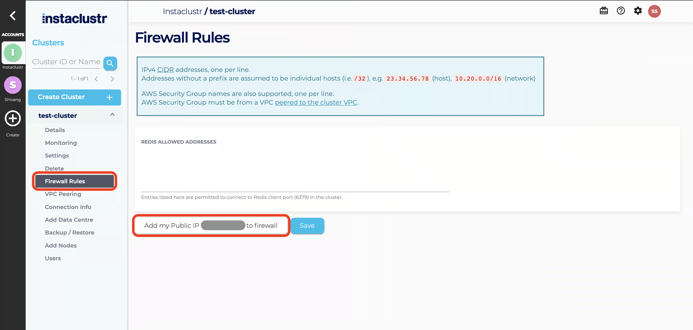

# Cadence cluster management

## Available spec fields

| Field                  | Type                                                                                 | Description                                                                                                                                                                                                                                                                                                                                  |
|------------------------|--------------------------------------------------------------------------------------|----------------------------------------------------------------------------------------------------------------------------------------------------------------------------------------------------------------------------------------------------------------------------------------------------------------------------------------------|
| name                   | string <br /> **required**                                                           | Cluster name. Should have length from 3 to 32 symbols.                                                                                                                                                                                                                                                                                       |
| version                | string <br /> **required**                                                           | Cadence instance version. <br />**Available versions**: `0.22.4`, `0.24.0`.                                                                                                                                                                                                                                                                  |
| pciCompliance          | bool <br /> **required**                                                             | Creates a PCI compliant cluster, see [PCI Compliance](https://www.instaclustr.com/support/documentation/useful-information/pci-compliance/)                                                                                                                                                                                                  |
| privateNetworkCluster  | bool <br /> **required**                                                             | Creates the cluster with private network only, see [Private Network Clusters](https://www.instaclustr.com/support/documentation/useful-information/private-network-clusters/).                                                                                                                                                               |
| slaTier                | string <br /> **required**                                                           | SLA Tier of the cluster. Non-production clusters may receive lower priority support and reduced SLAs. Production tier is not available when using Developer class nodes. See [SLA Tier](https://www.instaclustr.com/support/documentation/useful-information/sla-tier/) for more information. <br/>**Enum**: `PRODUCTION`, `NON_PRODUCTION`. |
| twoFactorDelete        | Array of objects ([TwoFactorDelete](#TwoFactorDeleteObject)) <br /> _mutable_        | Contacts that will be contacted when cluster request is sent.                                                                                                                                                                                                                                                                                |
| dataCentres            | Array of objects ([CadenceDataCentre](#CadenceDataCentreObject)) <br /> **required** | Object fields are described below as a bulleted list.                                                                                                                                                                                                                                                                                        |
| description            | string                                                                               | Description of the Cadence cluster.                                                                                                                                                                                                                                                                                                          |
| useCadenceWebAuth      | bool <br /> **required**                                                             | Enable Authentication for Cadence Web.                                                                                                                                                                                                                                                                                                       |
| awsArchival            | Array of objects ([AWSArchival](#AWSArchivalObject))                                 | Cadence AWS Archival settings.                                                                                                                                                                                                                                                                                                               |
| standardProvisioning   | Array of objects ([StandardProvisioning](#StandardProvisioningObject))               | Settings for STANDARD provisioning. Must not be defined with SHARED and PACKAGED provisioning options.                                                                                                                                                                                                                                       |
| sharedProvisioning     | Array of objects ([SharedProvisioning](#SharedProvisioningObject))                   | Settings for SHARED provisioning. Must not be defined with STANDARD and PACKAGED provisioning options.                                                                                                                                                                                                                                       |
| packagedProvisioning   | Array of objects ([PackagedProvisioning](#PackagedProvisioningObject))               | Settings for PACKAGED provisioning. Must not be defined with STANDARD and SHARED provisioning options.                                                                                                                                                                                                                                       |


### TwoFactorDeleteObject
| Field                   | Type                       | Description                                                                            |
|-------------------------|----------------------------|----------------------------------------------------------------------------------------|
| confirmationPhoneNumber | string                     | The phone number which will be contacted when the cluster is requested to be deleted.  |
| confirmationEmail       | string <br /> **required** | The email address which will be contacted when the cluster is requested to be deleted. |

### CadenceDataCentreObject
| Field                 | Type                                                                     | Description                                                                                                                                                                                                                                                                                                     |
|-----------------------|--------------------------------------------------------------------------|-----------------------------------------------------------------------------------------------------------------------------------------------------------------------------------------------------------------------------------------------------------------------------------------------------------------|
| name                  | string <br /> **required**                                               | A logical name for the data centre within a cluster. These names must be unique in the cluster.                                                                                                                                                                                                                 |
| region                | string <br /> **required**                                               | Region of the Data Centre. See the description for node size for a compatible Data Centre for a given node size.                                                                                                                                                                                                |
| cloudProvider         | string <br /> **required**                                               | Name of the cloud provider service in which the Data Centre will be provisioned. <br />**Enum**: `AWS_VPC` `GCP` `AZURE` `AZURE_AZ`.                                                                                                                                                                            |
| accountName           | string                                                                   | For customers running in their own account. Your provider account can be found on the Create Cluster page on the Instaclustr Console, or the "Provider Account" property on any existing cluster. For customers provisioning on Instaclustr's cloud provider accounts, this property may be omitted.            |
| cloudProviderSettings | Array of objects ([CloudProviderSettings](#CloudProviderSettingsObject)) | Cloud provider specific settings for the Data Centre.                                                                                                                                                                                                                                                           |
| network               | string <br /> **required**                                               | The private network address block for the Data Centre specified using CIDR address notation. The network must have a prefix length between /12 and /22 and must be part of a private address space.                                                                                                             |
| nodeSize              | string <br /> **required**<br />_mutable_                                | Size of the nodes provisioned in the Data Centre. Available node sizes, see [Instaclustr API docs NodeSize](https://instaclustr.redoc.ly/Current/tag/Kafka-Connect-Cluster-V2#paths/~1cluster-management~1v2~1resources~1applications~1kafka-connect~1clusters~1v2~1/post!path=dataCentres/nodeSize&t=request). |
| nodesNumber           | int32 <br /> **required**<br />_mutable_                                 | Total number of nodes in the Data Centre. <br/>Available values: [1…5].                                                                                                                                                                                                                                         |
| tags                  | map[string]string                                                        | List of tags to apply to the Data Centre. Tags are metadata labels which allow you to identify, categorise and filter clusters. This can be useful for grouping together clusters into applications, environments, or any category that you require.<br/>**Format**:<br/>tags:<br/>- key: value.                |
| clientEncryption      | bool <br /> **required**                                                 | Enables Client ⇄ Node Encryption.                                                                                                                                                                                                                                                                               |                                                                                                                                                                                           
| privateLink           | Array of objects ([PrivateLink](#PrivateLinkObject))                     | Create a PrivateLink enabled cluster, see [PrivateLink](https://www.instaclustr.com/support/documentation/useful-information/privatelink).                                                                                                                                                                      |

### CloudProviderSettingsObject
| Field                  | Type   | Description                                                                                                                                                                                                                                                                                                                                                                                                                                 |
|------------------------|--------|---------------------------------------------------------------------------------------------------------------------------------------------------------------------------------------------------------------------------------------------------------------------------------------------------------------------------------------------------------------------------------------------------------------------------------------------|
| customVirtualNetworkId | string | **AWS**: VPC ID into which the Data Centre will be provisioned. The Data Centre's network allocation must match the IPv4 CIDR block of the specified VPC.<br />**GCP**: Network name or a relative Network or Subnetwork URI e.g. projects/my-project/regions/us-central1/subnetworks/my-subnet. The Data Centre's network allocation must match the IPv4 CIDR block of the specified subnet. <br />Cannot be provided with `resourceGroup` |
| resourceGroup          | string | The name of the Azure Resource Group into which the Data Centre will be provisioned. <br />Cannot be provided with `customVirtualNetworkId` and `diskEncryptionKey`                                                                                                                                                                                                                                                                         |
| diskEncryptionKey      | string | ID of a KMS encryption key to encrypt data on nodes. KMS encryption key must be set in Cluster Resources through the Instaclustr Console before provisioning an encrypted Data Centre. <br />Cannot be provided with `customVirtualNetworkId`                                                                                                                                                                                               |

### PrivateLinkObject
| Field              | Type                       | Description                                                    |
|--------------------|----------------------------|----------------------------------------------------------------|
| advertisedHostname | string <br /> **required** | The hostname to be used to connect to the PrivateLink cluster. |

### AWSArchivalObject
| Field                       | Type                        | Description                                                                    |
|-----------------------------|-----------------------------|--------------------------------------------------------------------------------|
| archivalS3Uri               | string <br /> **required**  | S3 resource URI.                                                               |
| archivalS3Region            | string <br /> **required**  | S3 resource region.                                                            |
| awsAccessKeySecretNamespace | string <br /> **required**  | Namespace of the secret in which AWS Access Key and AWS Secret Key are stored. |
| awsAccessKeySecretName      | string <br /> **required**  | Name of the secret in which AWS Access Key and AWS Secret Key are stored.      |

### StandardProvisioningObject
| Field              | Type                                                                    | Description                                           |
|--------------------|-------------------------------------------------------------------------|-------------------------------------------------------|
| advancedVisibility | Array of objects ([AdvancedVisibility](#AdvancedVisibilityObject))      | Cadence advanced visibility settings.                 |
| targetCassandra    | Object ([TargetCassandra](#TargetCassandraObject)) <br /> **required**  | Target Cassandra cluster settings.                    |

### AdvancedVisibilityObject
| Field                | Type                                                                      | Description                         |
|----------------------|---------------------------------------------------------------------------|-------------------------------------|
| targetKafka          | Object ([TargetKafka](#TargetKafkaObject)) <br /> **required**            | Target Kafka cluster settings.      |
| targetOpenSearch     | Object ([TargetOpenSearch](#TargetOpenSearchObject)) <br /> **required**  | Target OpenSearch cluster settings. |

### TargetKafkaObject
| Field             | Type                       | Description                                           |
|-------------------|----------------------------|-------------------------------------------------------|
| dependencyCdcId   | string <br /> **required** | ID of the supporting Cluster's Cluster Data Centre.   |
| dependencyVpcType | string <br /> **required** | **Enum:** `TARGET_VPC`, `VPC_PEERED`, `SEPARATE_VPC`. |

### TargetOpenSearchObject
| Field             | Type                       | Description                                           |
|-------------------|----------------------------|-------------------------------------------------------|
| dependencyCdcId   | string <br /> **required** | ID of the supporting Cluster's Cluster Data Centre.   |
| dependencyVpcType | string <br /> **required** | **Enum:** `TARGET_VPC`, `VPC_PEERED`, `SEPARATE_VPC`. |

### TargetCassandraObject
| Field             | Type                       | Description                                           |
|-------------------|----------------------------|-------------------------------------------------------|
| dependencyCdcId   | string <br /> **required** | ID of the supporting Cluster's Cluster Data Centre.   |
| dependencyVpcType | string <br /> **required** | **Enum:** `TARGET_VPC`, `VPC_PEERED`, `SEPARATE_VPC`. |


### SharedProvisioningObject
| Field                    | Type                     | Description               |
|--------------------------|--------------------------|---------------------------|
| useAdvancedVisibility    | bool <br /> **required** | Use Advanced Visibility.  |

### PackagedProvisioningObject
| Field                 | Type                                                                                | Description                             |
|-----------------------|-------------------------------------------------------------------------------------|-----------------------------------------|
| useAdvancedVisibility | bool <br /> **required**                                                            | Use Advanced Visibility.                |
| bundledKafkaSpec      | Object ([BundledKafkaSpec](#BundledKafkaSpecObject))                                | Spec of the Kafka bundled cluster.      |
| bundledOpenSearchSpec | Object ([BundledOpenSearchSpec](#BundledOpenSearchSpecObject))                      | Spec of the OpenSearch bundled cluster. |
| bundledCassandraSpec  | Object ([BundledCassandraSpec](#BundledCassandraSpecObject)) <br /> **required**    | Spec of the Cassandra bundled cluster.  |

### BundledKafkaSpecObject
| Field               | Type                       | Description                                                                                                                                                                                                                                                                                   |
|---------------------|----------------------------|-----------------------------------------------------------------------------------------------------------------------------------------------------------------------------------------------------------------------------------------------------------------------------------------------|
| nodeSize            | string <br /> **required** | Size of the nodes provisioned in the Data Centre. Available node sizes, see [Instaclustr API docs NodeSize](https://instaclustr.redoc.ly/Current/tag/Kafka-Cluster-V2#paths/~1cluster-management~1v2~1resources~1applications~1kafka~1clusters~1v2/post!path=dataCentres/nodeSize&t=request). |
| nodesNumber         | int32 <br /> **required**  | Total number of nodes in the Data Centre. <br/>Available values: [1…5].                                                                                                                                                                                                                       |
| network             | string <br /> **required** | The private network address block for the Data Centre specified using CIDR address notation. The network must have a prefix length between /12 and /22 and must be part of a private address space.                                                                                           |
| replicationFactor   | int <br /> **required**    | Default Replication factor to use for new topic. Also represents the number of racks to use when allocating nodes.                                                                                                                                                                            |
| partitionsNumber    | int <br /> **required**    | Default number of partitions to use when created new topics.                                                                                                                                                                                                                                  |

### BundledOpenSearchSpecObject
| Field                      | Type                       | Description                                                                                                                                                                                                                                                                                           |
|----------------------------|----------------------------|-------------------------------------------------------------------------------------------------------------------------------------------------------------------------------------------------------------------------------------------------------------------------------------------------------|
| nodeSize                   | string <br /> **required** | Size of the nodes provisioned in the Data Centre. Available node sizes, see [Instaclustr API docs NodeSize](https://instaclustr.redoc.ly/Current/tag/Cluster-Resource?_ga=2.261654733.1169092465.1661786388-1184637702.1659440305#operation/extendedProvisionRequestHandler!path=nodeSize&t=request). |
| nodesPerReplicationFactor  | int <br /> **required**    | Total number of nodes in the Data Centre. <br/>Available values: [1…5].                                                                                                                                                                                                                               |
| network                    | string <br /> **required** | The private network address block for the Data Centre specified using CIDR address notation. The network must have a prefix length between /12 and /22 and must be part of a private address space.                                                                                                   |
| replicationFactor          | int <br /> **required**    | Default Replication factor to use for new topic. Also represents the number of racks to use when allocating nodes.                                                                                                                                                                                    |

### BundledCassandraSpecObject
| Field                          | Type                       | Description                                                                                                                                                                                                                                                                                           |
|--------------------------------|----------------------------|-------------------------------------------------------------------------------------------------------------------------------------------------------------------------------------------------------------------------------------------------------------------------------------------------------|
| nodeSize                       | string <br /> **required** | Size of the nodes provisioned in the Data Centre. Available node sizes, see [Instaclustr API docs NodeSize](https://instaclustr.redoc.ly/Current/tag/Cassandra-Cluster-V2#paths/~1cluster-management~1v2~1resources~1applications~1cassandra~1clusters~1v2/post!path=dataCentres/nodeSize&t=request). |
| nodesPerReplicationFactor      | int <br /> **required**    | Total number of nodes in the Data Centre. <br/>Available values: [1…5].                                                                                                                                                                                                                               |
| network                        | string <br /> **required** | The private network address block for the Data Centre specified using CIDR address notation. The network must have a prefix length between /12 and /22 and must be part of a private address space.                                                                                                   |
| replicationFactor              | int <br /> **required**    | Default Replication factor to use for new topic. Also represents the number of racks to use when allocating nodes.                                                                                                                                                                                    |
| privateIPBroadcastForDiscovery | bool <br /> **required**   | Enables broadcast of private IPs for auto-discovery.                                                                                                                                                                                                                                                  |
| passwordAndUserAuth            | bool <br /> **required**   | Enables Password Authentication and User Authorization.                                                                                                                                                                                                                                               |

## Cluster create flow
To create a Cadence cluster instance you need to prepare the yaml manifest. Here is an example:

```yaml
# cadence.yaml
apiVersion: clusters.instaclustr.com/v1beta1
kind: Cadence
metadata:
  name: cadence-sample
spec:
  name: "CadenceCluster"
  version: "0.24.0"
  standardProvisioning:
    - targetCassandra:
        dependencyCdcId: "66abf438-0020-4e2d-a39b-78706b7de064"
        dependencyVpcType: "VPC_PEERED"
  privateNetworkCluster: false
  dataCentres:
    - region: "US_EAST_1"
      network: "10.3.0.0/16"
      cloudProvider: "AWS_VPC"
      name: "testDC"
      nodeSize: "CAD-DEV-t3.small-5"
      nodesNumber: 1
      privateLink:
        - advertisedHostname: "cadence.test.com"
      clientEncryption: false
  description: "testCluster"
  slaTier: "NON_PRODUCTION"
  useCadenceWebAuth: true
```

If you want to enable AWSArchival option, please create a secret **before** cluster creation:
```yaml
# cadence-aws-secret.yaml
apiVersion: v1
kind: Secret
metadata:
  name: aws-cred-secret
data:
  awsAccessKeyId: access_key
  awsSecretAccessKey: secret_key
```

Apply it:
```console
kubectl apply -f cadence-aws-secret.yaml
```

Next, you need to apply the manifest in your K8s cluster. This will create a custom resource instance inside (more info about an apply command you can find [here](https://kubernetes.io/docs/reference/generated/kubectl/kubectl-commands#apply)):
```console
kubectl apply -f cadence.yaml
```

Now you can get and describe the instance:
```console
kubectl get cadences.clusters.instaclustr.com cadence-sample
```
```console
kubectl describe cadences.clusters.instaclustr.com cadence-sample
```

After you have applied the entity, the Instaclustr operator will create it on your K8s cluster and send a request to the Instaclustr API. You can be sure, that the resource creation call was sent if the instance has an id field filled in the status section.

You can check access to the created cluster from your kubernetes cluster and run some simple command to check that it is working with a lot of tools.
All available tools you can find in the Instaclustr console -> Choose your cluster -> Connection Info -> Examples section.

When a cluster is provisioned, a new service will be created along with it that expose public IP addresses. You can use this service name (pattern **{k8s_cluster_name}-service**) instead of public IP addresses and ports to connect to and interact with your cluster.
To do this, the public IP address of your machine must be added to the Firewall Rules tab of your cluster in the Instaclustr console.

Then, you can use the service name instead of public addresses and port.

## Cluster update flow
To update a cluster you can apply an updated cluster manifest or edit the custom resource instance in kubernetes cluster:
* Apply an updated cluster manifest:
    ```console
    kubectl apply -f cadence.yaml
    ```
* Edit the custom resource instance:
    ```console
    kubectl edit cadences.clusters.instaclustr.com cadence-sample
    ```
You can only update fields that are **mutable**

## Cluster delete flow

### Cluster deletion
To delete cluster run:
```console
kubectl delete cadences.clusters.instaclustr.com cadence-sample
```

It can take some time to delete the resource.

### Cluster deletion with twoFactorDelete option enabled
To delete cluster with twoFactorDelete option enabled you need to set the confirmation annotation to true:
```yaml
Annotations:  
  "instaclustr.com/deletionConfirmed": true
```

And then simply run:
```console
kubectl delete cadences.clusters.instaclustr.com cadence-sample
```

After that, deletion confirmation email will be sent to the email defined in the `confirmationEmail` field of `TwoFactorDelete`. When deletion is confirmed via email, Instaclustr support will delete the cluster and the related cluster resources inside K8s will be also removed.
