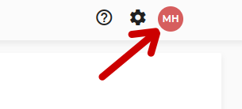
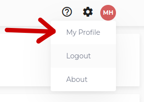
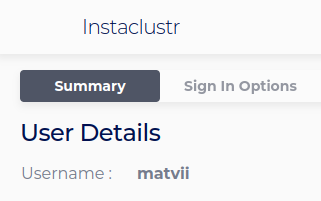
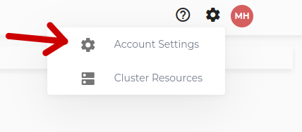

## Using Instaclustr with Kubernetes
This document will instruct you how to install the instaclustr operator in your Kubernetes cluster
and how to work with it.

Also, you can see [demo](https://drive.google.com/file/d/1HNRimZRKkzYU57S1mBfS_MakQLp4k3c9/view?usp=sharing) video with all these instructions.

We will complete the following steps:
1. Install Instaclustr operator
2. Create Cassandra cluster
3. Update Cassandra cluster
4. Delete Cassandra cluster

### Install Instaclustr operator
#### 1. Deploy cert manager
``` sh
kubectl apply -f https://github.com/cert-manager/cert-manager/releases/download/v1.10.0/cert-manager.yaml
```

#### 2. Install helm
Download and Install helm on your Kubernetes cluster from [source](https://helm.sh/docs/intro/install/).

#### 3. Use helm to install Instaclustr operator
Using helm, add the instaclustr operator to Helm repository. More details [here](https://helm.sh/docs/helm/helm_repo_add/).
```sh   
helm repo add operator-chart https://instaclustr.github.io/operator-helm/
```

#### Install Instaclustr operator in your Kubernetes cluster. More details here.
Change test values to your actual data
- USERNAME - UserName can be retrieved from the console by going to account icon to the top right > My Profile > User Details.






- APIKEY - Account API keys can be retrieved any time from the console by going to gear icon to the top right > Account Settings > API Keys. More details here.





- HOSTNAME - Default value is api.instaclustr.com. You can change it if you want to use another HostName. More information here.

```sh  
helm install operator operator-chart/operator \
--set USERNAME=test \
--set APIKEY=test \
--set HOSTNAME=api.instaclustr.com \
-n instaclustr-operator --create-namespace
```
You can run ``` kubectl get pods -n instaclustr-operator ``` to check if operator is running.

**_All examples for all available resources you can find in "doc" folder_**